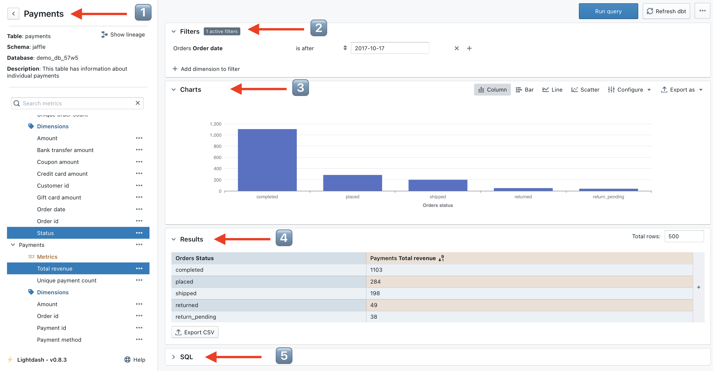

# Using Explores in Lightdash

An **explore** is the main starting point for exploring data in Lightdash. An explore contains a group of related 
dbt models, dimensions, and metrics.

There are 4 main areas to the explore view:

1. The list of metrics and dimensions available on the explore
2. The filters panel to allow you to restrict the data pulled into Lightdash
3. The chart panel to visualise the results of queries
4. The results panel to explore the results of queries in a tabular format
    

## Running your first query

To run a query:

1. Select a metric to calculate
2. Select one or more dimensions to split the metric into groups
3. Hit "Run Query" in the top right

For example, if I wanted to know the "total number of orders split by order status", I'd select the `Unique order 
count` metric to calculate the number of orders and the `Status` dimension to split that by status.

## Visualising query results as a chart

Once the query executes, the results will show in the results table. You can then open the charts section and choose 
a chart type to visualise the metric.

## Saving a chart

Saved Charts allow you to save a specific chart or visualisation so you can share it or revisit it again in future.

When you open a saved charts, it will always update to display the latest data in your database. To save a chart:

1. In the top right of the explore you will find the "three dots" and an option to save your chart.
2. Enter a memorable name for the chart, a good idea is to use a question as the name "How many orders are there at each stage?"
